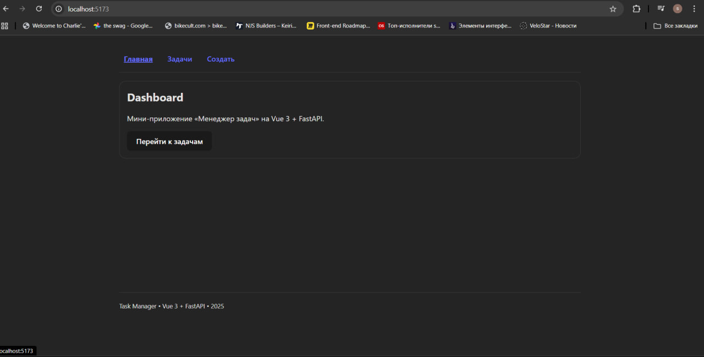
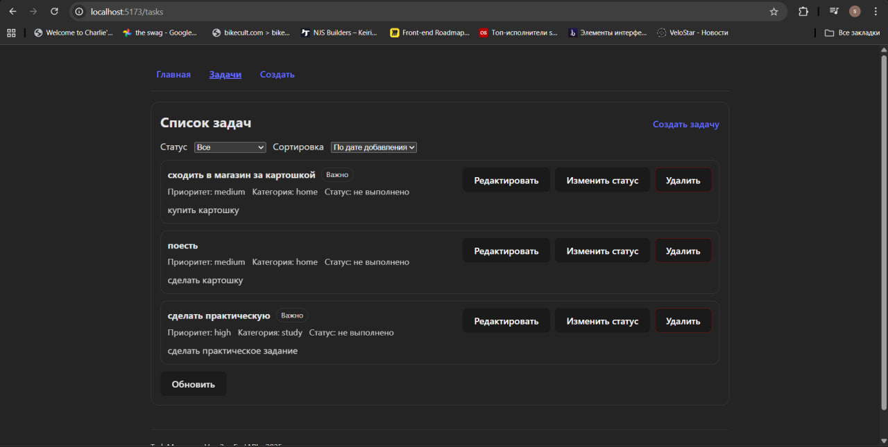
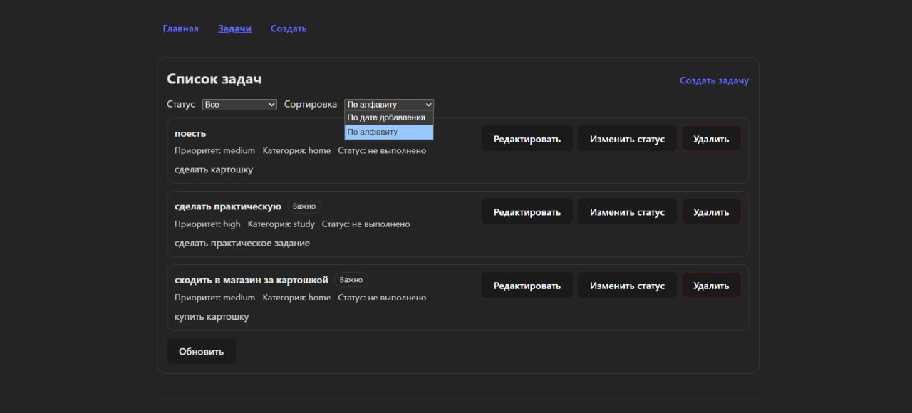
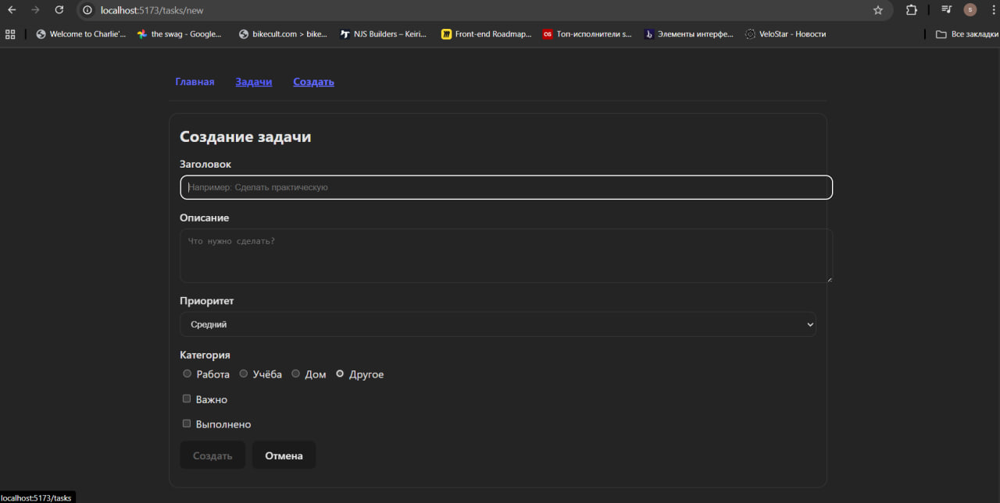
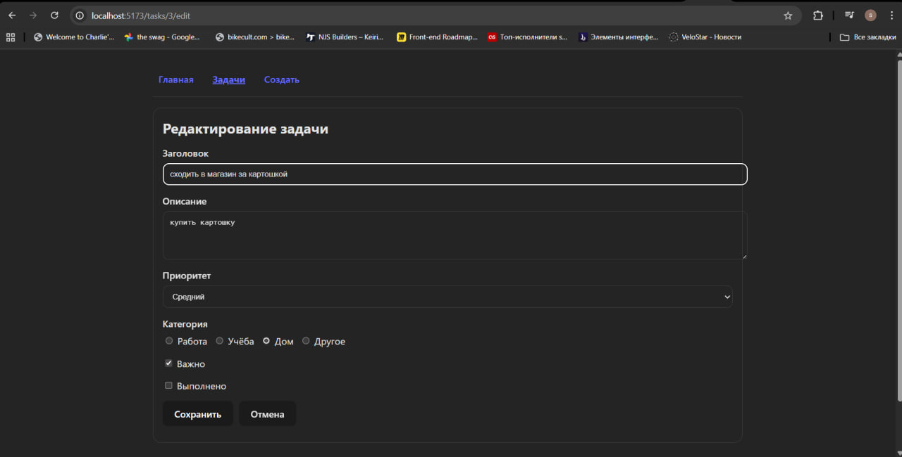

# Отчёт по практической работе (Vue 3)

## 1. Титульная часть

- Автор: **Суржицкий Арсений Арсентьевич**
- Группа: **Р3468**
- Тема: **Разработка SPA-приложения «Менеджер задач» на Vue 3 + FastAPI**
- Дата: **27.12.2025**

Ссылка на репозиторий: https://github.com/whyamiherewhyamihere/vue-fastapi-task-manager

## 2. Цель работы

Освоить базовые возможности Vue 3 (reactivity, computed/watch, формы, компоненты/props/events, слоты, Vue Router) и взаимодействие с сервером через REST API, а также контейнеризацию проекта в Docker.

## 3. Реализованный функционал

### Клиент (Vue 3)

- Страницы:
  - `/` — приветственный экран (Dashboard) с кнопкой перехода к задачам
  - `/tasks` — список задач
  - `/tasks/new` — создание задачи
  - `/tasks/:id/edit` — редактирование задачи
  - `404` — страница не найдено
- Компоненты:
  - `AppHeader.vue`, `AppFooter.vue`
  - `LayoutCard.vue` (слоты)
  - `TaskList.vue`, `TaskItem.vue`
  - `TaskForm.vue`
- computed/watch:
  - computed: фильтрация и сортировка списка задач (`filteredTasks`, `sortedTasks`)
  - watch: синхронизация фильтра/сортировки с query-параметрами URL (`status`, `sort`)
- Формы:
  - поля: заголовок, описание, приоритет, категория (radio), важно (checkbox), выполнено (checkbox)
  - `v-model` с модификаторами: `.trim`, `.lazy.trim`
  - простая валидация заголовка
- Работа с refs и жизненным циклом:
  - `ref` на поле заголовка + `onMounted` для автофокуса
- Коммуникация:
  - события от `TaskItem` → родитель (`delete`, `toggle`, `edit`)

### Слоты

- Обычный слот и именованные слоты: `LayoutCard.vue` (`header`, `footer`, default)
- Scoped slot: `TaskList.vue` предоставляет `#item="{ task }"`

### Маршрутизация (Vue Router)

- Именованные маршруты: `home`, `tasks`, `task-new`, `task-edit`, `not-found`
- Вложенные маршруты: `/tasks` → дочерние `''`, `new`, `:id/edit`
- Программная навигация: переходы через `router.push(...)` (после создания/редактирования)
- Страница 404: `/:pathMatch(.*)*`

### Сервер (FastAPI)

CRUD API:
- `GET /api/tasks`
- `GET /api/tasks/{id}`
- `POST /api/tasks`
- `PUT /api/tasks/{id}`
- `DELETE /api/tasks/{id}`

Хранение данных:
- SQLite (`tasks.db`), запись изменений выполняется при каждом запросе (commit).

## 4. Скриншоты интерфейса

Скриншоты лежат в папке `screenshots/` репозитория.


- Главная: 
- Список задач: 
- Фильтрация/сортировка: 
- Форма создания: 
- Форма редактирования: 
- Страница 404: 

## 5. Пример кода

Пример использования `TaskList` со scoped-slot:

```vue
<TaskList
  :tasks="sortedTasks"
  @delete="onDelete"
  @toggle="onToggle"
  @edit="onEdit"
>
  <template #item="{ task }">
    <TaskItem :task="task" @delete="onDelete" @toggle="onToggle" @edit="onEdit" />
  </template>
</TaskList>
```

Пример маршрутизации (вложенные и именованные маршруты + 404):

```js
const routes = [
  { path: '/', name: 'home', component: HomeView },
  {
    path: '/tasks',
    component: TasksLayout,
    children: [
      { path: '', name: 'tasks', component: TaskListView },
      { path: 'new', name: 'task-new', component: TaskNewView },
      { path: ':id/edit', name: 'task-edit', component: TaskEditView, props: true },
    ],
  },
  { path: '/:pathMatch(.*)*', name: 'not-found', component: NotFoundView },
]
```

Пример API-вызовов (REST к `/api/*`):

```js
export function getTasks() {
  return request('/api/tasks')
}

export function createTask(payload) {
  return request('/api/tasks', { method: 'POST', body: JSON.stringify(payload) })
}
```

Пример формы с `v-model` модификаторами и валидацией:

```vue
<input v-model.trim="form.title" @blur="touched.title = true" />
<p v-if="touched.title && errors.title" class="error">{{ errors.title }}</p>

<textarea v-model.lazy.trim="form.description" rows="4" />
```

Пример backend-обработчика удаления (HTTP 204 без тела ответа):

```py
@app.delete('/api/tasks/{task_id}', status_code=204, response_class=Response)
def delete_task(task_id: int) -> Response:
    ...
    return Response(status_code=204)
```

## 6. Пример данных (SQLite)

Пример сущности задачи:

```json
{
  "id": 1,
  "title": "Создать Vue-компонент",
  "description": "Сделать TaskItem и TaskList",
  "completed": false,
  "priority": "high",
  "category": "study",
  "important": true,
  "created_at": "2025-12-27T12:00:00+00:00"
}
```

## 7. Инструкция по запуску (Docker)

```bash
docker compose build
docker compose up
```

- Frontend: http://localhost:8080
- Backend: http://localhost:8000

## 8. Выводы

В ходе работы были изучены:
- основы Vue 3 (реактивность, computed/watch, компоненты, props/emits)
- формы и валидация, `v-model` и модификаторы
- Vue Router (вложенные маршруты, именованные маршруты, 404, программная навигация)
- взаимодействие с REST API
- Docker-сборка фронтенда и бэкенда, запуск через docker-compose
